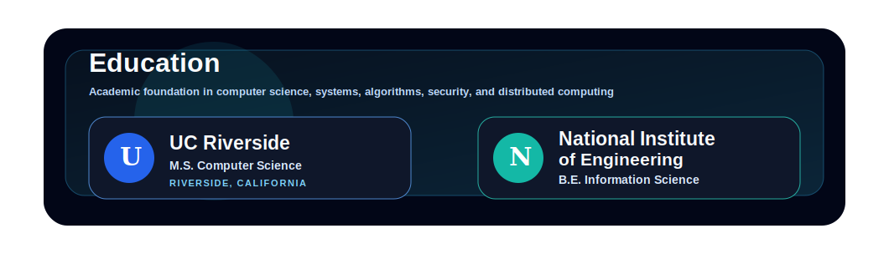

  

<b>Career Progression</b>

 

<b>Engineering Dashboard</b>

 

<b>Technology Matrix</b>

 

  

  
  
  
  
  
  
  
  

<b>Education</b>

 

<b>Focus Areas</b>

 

  
  
  
  
  

<b>Contact</b>

 

  
  
  

  

