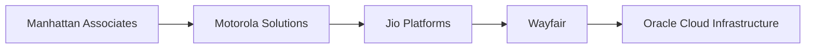

<p align="center">
  
</p>

<p align="center">
  <a href="https://git.io/typing-svg"></a>
</p>

<p align="center">
  <a href="https://github.com/puneetsinghania"></a>
  <a href="https://www.linkedin.com/in/puneet-singhania"></a>
  <a href="mailto:puneetsinghania2002@gmail.com"></a>
  
</p>

<p align="center">
  
</p>

<table>
<tr>
<td width="58%" valign="top">

## Hi, I am Puneet

I am a software engineer focused on backend systems, cloud infrastructure, distributed workflows, and high-scale product platforms. I like building services that stay reliable under pressure, make complex systems easier to operate, and turn messy product problems into clean engineering surfaces.

- Software Engineer III at **Oracle Cloud Infrastructure**
- Master of Science in Computer Science from **University of California, Riverside**
- Based in the **San Francisco Bay Area**
- Strongest in **Java, Spring Boot, distributed systems, cloud infrastructure, microservices, Kafka, Redis, SQL, Docker, and Kubernetes**
- Interested in **platform engineering, orchestration systems, system design, AI-enabled developer tooling, and scalable backend architecture**

</td>
<td width="42%" valign="top">


<br />


</td>
</tr>
</table>

---

## Companies I have built for

<p align="center">
  
  
  
  
  
</p>



---

## Systems I like building

<table>
<tr>
<td align="center" width="25%">
  
  <br /><b>Backend Services</b>
  <br /><sub>APIs, service design, reliability</sub>
</td>
<td align="center" width="25%">
  
  <br /><b>Event Platforms</b>
  <br /><sub>Kafka, async workflows, scale</sub>
</td>
<td align="center" width="25%">
  
  <br /><b>Cloud Infra</b>
  <br /><sub>Orchestration, containers, ops</sub>
</td>
<td align="center" width="25%">
  
  <br /><b>High Traffic Systems</b>
  <br /><sub>Cache, latency, throughput</sub>
</td>
</tr>
</table>

---

## Engineering toolkit

<p align="center">
  
</p>

<details open>
<summary><b>Core stack</b></summary>
<br />


</details>

<details>
<summary><b>Cloud, data, and DevOps</b></summary>
<br />


</details>

<details>
<summary><b>How I think about systems</b></summary>
<br />

```text
reliable systems        > flashy systems
clear APIs              > clever APIs
observable workflows    > silent failures
simple ownership        > scattered context
shipping with quality   > shipping with luck
```

I enjoy taking systems from "it works" to "it is understandable, operable, scalable, and boring in production." Most of my work sits around backend platforms, workflow orchestration, product infrastructure, and services that need to handle real traffic with clean failure modes.

</details>

---

## GitHub visual dashboard

<p align="center">
  
  
</p>

<p align="center">
  
  
</p>

<p align="center">
  
</p>

<p align="center">
  
</p>

---

## Explore more

<details>
<summary><b>Education</b></summary>
<br />

- **University of California, Riverside** - Master of Science in Computer Science
- **The National Institute of Engineering** - Bachelor of Engineering in Information Science

</details>

<details>
<summary><b>Focus areas</b></summary>
<br />

- Distributed workflow orchestration
- Backend service architecture
- Platform engineering and infrastructure automation
- Observability, reliability, and failure isolation
- High traffic product systems
- AI-enabled developer tooling

</details>

<details>
<summary><b>Quick contact</b></summary>
<br />

<p align="center">
  <a href="https://www.linkedin.com/in/puneet-singhania"></a>
  <a href="mailto:puneetsinghania2002@gmail.com"></a>
  <a href="https://github.com/puneetsinghania"></a>
</p>

</details>

<p align="center">
  
</p>
