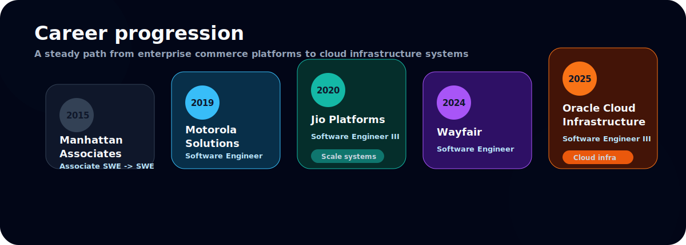
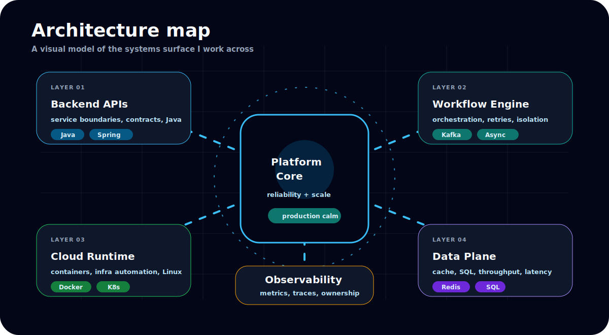
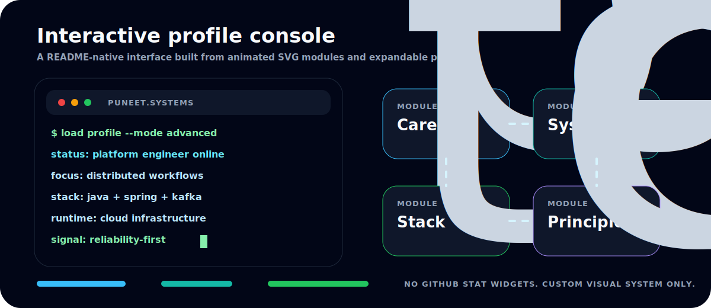

  

  

  
  
  

 

<b>Open career trajectory</b>

 

<b>Open architecture map</b>

 

<b>Open profile console</b>

 

<b>Open technology matrix</b>

 

  

  
  
  
  
  
  
  
  

<b>Open principles console</b>

 

<b>Open education and focus areas</b>

 

<table>
<tr>
<td width="50%" align="center">
  
</td>
<td width="50%" align="center">
  
</td>
</tr>
</table>

  
  
  
  
  

  
  

  

